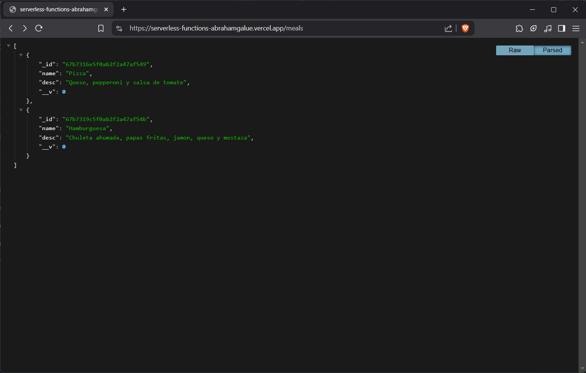
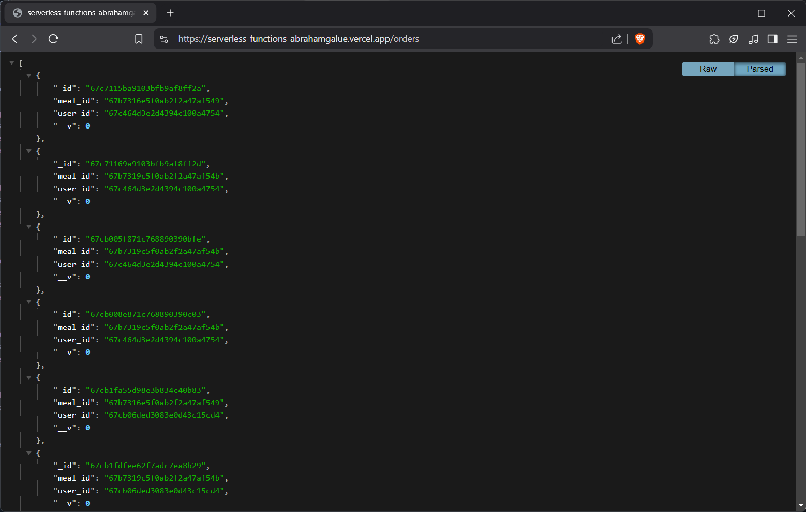
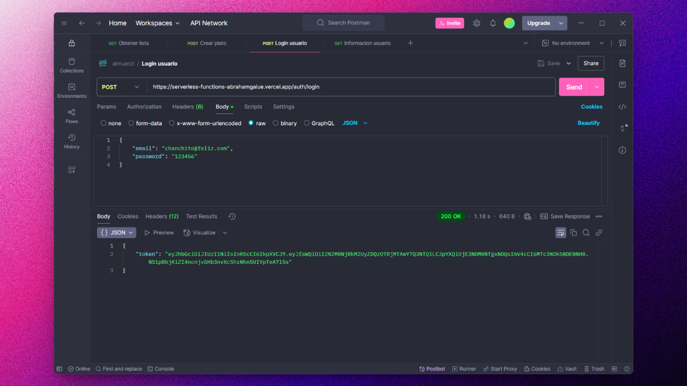
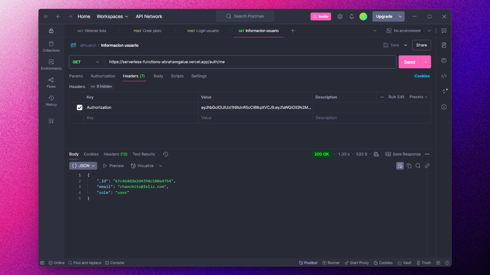

# 💽 NODE/EXPRESS: Serverless Functions

### API REST para comidas, ordenes y autenticación.

> 🧩 Aquí puedes ver su [**Live Demo.**](https://serverless-functions-abrahamgalue.vercel.app/meals)

## 🚀 Descripción

Este proyecto de curso utiliza MongoDB para la gestión de datos, respondiendo a consultas de una aplicación frontend.

La autenticación y autorización de usuarios se implementan mediante JWT.

## 🎭 Tecnologías

El proyecto utiliza las siguientes tecnologías:

- [**Express**](https://expressjs.com/) como framework de Node.js.

- [**MongoDB**](https://www.mongodb.com/) como base de datos.

- [**JWT**](https://jwt.io/) para la autenticación y autorización de los usuarios.